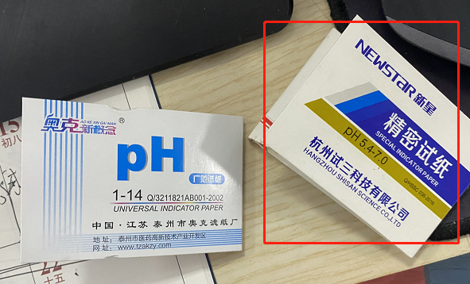

# **感官实验**

## 目的

①得到感官的滋味描述 

②对应滋味的识别阈值，但是一定要和感官员强调清楚，重点是 鲜味 和 苦味 的 ，只有有一点或者相关的滋味都可以认为是对应的滋味

## 所需材料

小烧杯： 可以买 ，但是这次一下子买了几万个，就不愁了，所以暂不考虑

试纸：必须要高精度的，下次注意，不可以马虎，可以找实验室 味觉比较敏感的师姐们帮忙调整一下对应的PH，确保味道柔和，不要奇奇怪怪

# 预实验

目的：弄清有滋味 + 弄清楚滋味大概的范围

- 筛选出合理的人：需要Test实验，1%的MSG溶液和水，需要大家能够区分开来

  可以参考的名单有：

  - 我的实验中，敏感的人们：周雪珂，朱忆雯，汪梦妮，陈禹蒙，崔智勇，孟恒立，孙怡辰？ 刘静？
  - 春玉实验中，优秀的人们：

- 弄清楚大致的实验阈值，可以大差别给，比如0.05，0.1 0.5 1.0 2.0 这种，确保阈值高的人也要能尝出来

- 做两次，也就是有一次平行，下面我的是配置10ml，那么直接分成5ml两个样就好

## 各肽配置方法

### LPG

0.05  0.1 0.2  0.4  0.6  0.8 

| 名  称      | 操  作                                                       | 浓  度  | 体 积 | 富余量       |           |
| ----------- | ------------------------------------------------------------ | ------- | ----- | ------------ | --------- |
| 母液1       | 250mg分装肽直接加入1ml枪头吸取的水溶液                       | 250g/L  | 1ml   | 1-0.2=0.8ml  |           |
| 母液2       | 取0.2ml 然后加水配置到20ml【烧杯中】，并配置pH=6.5[记得采用磁力搅拌器] | 2.5g/L  | 20ml  | 10-1-2-5=2ml |           |
|             |                                                              |         |       |              |           |
| 待测样0.1 🌟 | 计算所需母液的量：0.1[浓度]x10[一次饮用量]x5人 / 5[母液2的浓度] = 1ml  取2ml母液2，稀释25倍，加到50ml | 0.1mg/L | 50    |              | LPG 无效  |
| 待测样0.2 🌟 | 计算所需母液的量：0.2[浓度]x10[一次饮用量]x5人 / 5[母液2的浓度] = 2ml 取4ml母液2，稀释12.5倍，加到50ml | 0.2mg/L | 50    |              | LPG 无效  |
| 测样0.3 🌟   | 计算所需母液的量：0.2[浓度]x10[一次饮用量]x5人 / 5[母液2的浓度] = 2ml 取6ml母液2，稀释50/6倍，加到50ml | 0.3mg/L | 50    |              |           |
| 待测样0.5   | 计算所需母液的量：0.5[浓度]x10[一次饮用量]x5人 / 5[母液2的浓度] = 5ml 取10ml母液2，稀释5倍，加到50ml | 0.5mg/L | 50    |              | LPG  work |

### ECH

| 富余量    | 名  称         | 操  作                                                       | 浓  度  | 体 积 |      |
| --------- | -------------- | ------------------------------------------------------------ | ------- | ----- | ---- |
| 1-0.4=0.6 | 母液1          | 250mg分装肽直接加入1ml枪头吸取的水溶液                       | 250g/L  | 1ml   |      |
|           | 母液2          | 取0.4ml【100mg】 然后加水配置到40ml【烧杯中】，并配置pH=6.5[记得采用磁力搅拌器] | 2.5g/L  | 40ml  |      |
|           | 子液           |                                                              |         |       |      |
|           |                |                                                              |         |       |      |
|           | 待测样0.2      | 计算所需母液的量：0.2[浓度]x10[一次饮用量]x5人 / 5[母液2的浓度] = 2ml 取4ml母液2，加到50ml | 0.2mg/L | 50    |      |
|           | 待测样0.4 * 1* | 计算所需母液的量：0.5[浓度]x10[一次饮用量]x5人 / 5[母液2的浓度] = 5ml 取8ml母液2，加到50ml | 0.4mg/L | 50    |      |
|           | 待测样0.6      | 计算所需母液的量：0.5[浓度]x10[一次饮用量]x5人 / 5[母液2的浓度] = 5ml 取12ml母液2，加到50ml | 0.6mg/L | 50    |      |
|           | 待测样0.8*1    | 计算所需母液的量：0.5[浓度]x10[一次饮用量]x5人 / 5[母液2的浓度] = 5ml 取16ml母液2，加到50ml | 0.8mg/L | 50    |      |
|           | 待测样1.0      | 计算所需母液的量：0.5[浓度]x10[一次饮用量]x5人 / 5[母液2的浓度] = 5ml 取20ml母液2，加到50ml | 1.0mg/L | 50    |      |

# 实际实验

## 0.05、0.1、0.2、0.4、0.6、0.8配置法

### 计算量

10个人 x 6个梯度 x 3平行 =180个

对应的量：

| 浓度 mg/L x 10ml x 10个人 | 来源  | 对应的量 mg |
| ------------------------- | ----- | ----------- |
| 0.05                      | 母液2 | 5           |
| 0.1                       | 母液1 | 10          |
| 0.2                       | 母液2 | 20          |
| 0.4                       | 母液2 | 40          |
| 0.6                       | 母液2 | 60          |
| 0.8                       | 母液3 | 80          |
| 总共                      |       | 215         |

### 配置操作

【烧杯中】，并配置pH=6.5[记得采用磁力搅拌器] → 这一步如果把握不好，请找敏感的人做

| 名  称 | 浓  度    | 操  作                                   | 母液1 | 母液2       | 母液3 | 体 积 |
| ------ | --------- | ---------------------------------------- | ----- | ----------- | ----- | ----- |
| 母液   | 250g/L    | 250mg分装肽直接加入1ml枪头吸取的水溶液   |       |             |       | 1ml   |
| 母液1  | /         | /                                        | /     |             |       |       |
| 母液2  | 2.5g/L    | 取0.6ml 然后加水配置到60ml               |       | 60【富裕6】 |       | 50ml  |
| 母液3  | 0.8mg/L   | 取0.32ml 然后加水配置到100ml 直接样6配置 |       | 100         |       |       |
|        |           |                                          |       |             |       |       |
| 样1    | 0.05 mg/L | 取2ml母液2，加到100ml                    |       | 2           |       | 100   |
| 样2    | 0.1mg/L   | 取 4ml母液2，加到100ml                   |       | 4           |       | 100   |
| 样3    | 0.2mg/L   | 取8ml母液2，加到90 + 2 ml                |       | 8           |       | 100   |
| 样4    | 0.4mg/L   | 取16ml母液2，加到100ml                   |       | 16          |       | 100   |
| 样5    | 0.6mg/L   | 取24ml母液2，加到100ml                   |       | 24          |       | 100   |
| 样6    | 0.8mg/L   | 取100ml母液3，加到100ml                  |       | 100         |       | 100   |

## 结果

### LPG

### ECH

