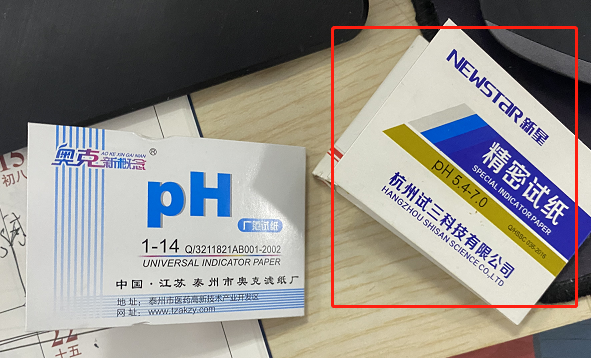

# *感官实验**

## 目的

①得到感官的滋味描述 

②对应滋味的识别阈值，但是一定要和感官员强调清楚，重点是 鲜味 和 苦味 的 ，只有有一点或者相关的滋味都可以认为是对应的滋味

## 所需材料

小烧杯： 可以买 ，但是这次一下子买了几万个，就不愁了，所以暂不考虑

试纸：必须要高精度的，下次注意，不可以马虎，可以找实验室 味觉比较敏感的师姐们帮忙调整一下对应的PH，确保味道柔和，不要奇奇怪怪

# 预实验

目的：弄清有滋味 + 弄清楚滋味大概的范围

- 筛选出合理的人：需要Test实验，1%的MSG溶液和水，需要大家能够区分开来

  可以参考的名单有：

  - 我的实验中，敏感的人们：周雪珂，朱忆雯，汪梦妮，陈禹蒙，崔智勇，孟恒立，孙怡辰？ 刘静？
  - 春玉实验中，优秀的人们：

- 弄清楚大致的实验阈值，可以大差别给，比如0.05，0.1 0.5 1.0 2.0 这种，确保阈值高的人也要能尝出来

- 做两次，也就是有一次平行，下面我的是配置10ml，那么直接分成5ml两个样就好

## 各肽配置方法

### LPG【原始版本已经放弃】

0.05  0.1 0.2  0.4  0.6  0.8 

| 名  称      | 操  作                                                       | 浓  度  | 体 积 | 富余量       |           |
| ----------- | ------------------------------------------------------------ | ------- | ----- | ------------ | --------- |
| 母液1       | 250mg分装肽直接加入1ml枪头吸取的水溶液                       | 250g/L  | 1ml   | 1-0.2=0.8ml  |           |
| 母液2       | 取0.2ml 然后加水配置到20ml【烧杯中】，并配置pH=6.5[记得采用磁力搅拌器] | 2.5g/L  | 20ml  | 10-1-2-5=2ml |           |
|             |                                                              |         |       |              |           |
| 待测样0.1 🌟 | 计算所需母液的量：0.1[浓度]x10[一次饮用量]x5人 / 5[母液2的浓度] = 1ml  取2ml母液2，稀释25倍，加到50ml | 0.1mg/L | 50    |              | LPG 无效  |
| 待测样0.2 🌟 | 计算所需母液的量：0.2[浓度]x10[一次饮用量]x5人 / 5[母液2的浓度] = 2ml 取4ml母液2，稀释12.5倍，加到50ml | 0.2mg/L | 50    |              | LPG 无效  |
| 测样0.3 🌟   | 计算所需母液的量：0.2[浓度]x10[一次饮用量]x5人 / 5[母液2的浓度] = 2ml 取6ml母液2，稀释50/6倍，加到50ml | 0.3mg/L | 50    |              |           |
| 待测样0.5   | 计算所需母液的量：0.5[浓度]x10[一次饮用量]x5人 / 5[母液2的浓度] = 5ml 取10ml母液2，稀释5倍，加到50ml | 0.5mg/L | 50    |              | LPG  work |

12-14更新版本：【这算的不对】

| 名  称      | 操  作                                                       | 浓  度  | 体 积 |      |      |
| ----------- | ------------------------------------------------------------ | ------- | ----- | ---- | ---- |
| 母液1       | 250mg分装肽直接加入10ml枪头吸取的水溶液                      | 25g/L   | 10ml  |      |      |
| 母液2       | 取2ml 然后加水配置到20ml【烧杯中】，并配置pH=6.5[记得采用磁力搅拌器] | 2.5g/L  | 20ml  |      |      |
|             |                                                              |         |       |      |      |
| 待测样0.1 🌟 | 计算所需母液的量：0.1[浓度]x10[一次饮用量]x5人 / 5[母液2的浓度] = 1ml  取2ml母液2，稀释25倍，加到50ml | 0.1mg/L | 50    |      |      |
| 待测样0.2 🌟 | 计算所需母液的量：0.2[浓度]x10[一次饮用量]x5人 / 5[母液2的浓度] = 2ml 取4ml母液2，稀释12.5倍，加到50ml | 0.2mg/L | 50    |      |      |
| 测样0.3 🌟   | 计算所需母液的量：0.2[浓度]x10[一次饮用量]x5人 / 5[母液2的浓度] = 2ml 取6ml母液2，稀释50/6倍，加到50ml | 0.3mg/L | 50    |      |      |
| 待测样0.5   | 计算所需母液的量：0.5[浓度]x10[一次饮用量]x5人 / 5[母液2的浓度] = 5ml 取10ml母液2，稀释5倍，加到50ml | 0.5mg/L | 50    |      |      |
|             |                                                              |         |       |      |      |
| 母液2       | 母液2本身就是2ml                                             |         |       |      |      |
|             |                                                              |         |       |      |      |

### ECH【错误，量超标，母液2超过50】

| 富余量    | 名  称     | 操  作                                                       | 浓  度  | 体 积 |      |
| --------- | ---------- | ------------------------------------------------------------ | ------- | ----- | ---- |
| 1-0.4=0.6 | 母液1      | 250mg分装肽直接加入1ml枪头吸取的水溶液                       | 250g/L  | 1ml   |      |
|           | 母液2      | 取0.4ml【100mg】 然后加水配置到40ml【烧杯中】，并配置pH=6.5[记得采用磁力搅拌器] | 2.5g/L  | 40ml  |      |
|           |            |                                                              |         |       |      |
|           | **子  液** |                                                              |         |       |      |
|           | 待测样0.2  | 计算所需母液的量：0.2[浓度]x10[一次饮用量]x5人 / 5[母液2的浓度] = 2ml 取4ml母液2，加到50ml | 0.2mg/L | 50    |      |
|           | 待测样0.4  | 计算所需母液的量：0.5[浓度]x10[一次饮用量]x5人 / 5[母液2的浓度] = 5ml 取8ml母液2，加到50ml | 0.4mg/L | 50    |      |
|           | 待测样0.6  | 计算所需母液的量：0.5[浓度]x10[一次饮用量]x5人 / 5[母液2的浓度] = 5ml 取12ml母液2，加到50ml | 0.6mg/L | 50    |      |
|           | 待测样0.8  | 计算所需母液的量：0.5[浓度]x10[一次饮用量]x5人 / 5[母液2的浓度] = 5ml 取16ml母液2，加到50ml | 0.8mg/L | 50    |      |
|           | 待测样1.0  | 计算所需母液的量：0.5[浓度]x10[一次饮用量]x5人 / 5[母液2的浓度] = 5ml 取20ml母液2，加到50ml | 1.0mg/L | 50    |      |

# 实际实验【最终选择的版本】

## 0.05、0.1、0.2、0.4、0.6、0.8配置法

### 计算量

10个人 x 6个梯度 x 3平行 =180个

对应的量：

| 浓度 mg/L x 10ml x 10个人 | 来源  | 对应的量 mg |
| ------------------------- | ----- | ----------- |
| 0.05                      | 母液2 | 5           |
| 0.1                       | 母液1 | 10          |
| 0.2                       | 母液2 | 20          |
| 0.4                       | 母液2 | 40          |
| 0.6                       | 母液2 | 60          |
| 0.8                       | 母液3 | 80          |
| 总共                      |       | 215         |

### 配置操作

【烧杯中】，并配置pH=6.5[记得采用磁力搅拌器] → 这一步如果把握不好，请找敏感的人做

【0.05/0.1/0.15/0.20/0.40/0.60/0.80】

| 名  称 | 浓  度   | 操  作                                                      | 母液1 | 母液2       | 母液3 | 体 积 |
| ------ | -------- | ----------------------------------------------------------- | ----- | ----------- | ----- | ----- |
| 母液1  | 250g/L   | 250mg分装肽直接加入1ml枪头吸取的水溶液                      |       |             |       | 1ml   |
|        | /        | /                                                           | /     |             |       |       |
| 母液2  | 2.5 g/L  | 取0.6ml母液1， 然后加水配置到60ml【可以配置到55开始调整PH】 |       | 60【富裕6】 |       | 50ml  |
| 母液3  | 0.8 g/L  | 取0.32ml母液1， 然后加水配置到100ml 直接样7配置             |       | 100         |       |       |
|        |          |                                                             |       |             |       |       |
| 样1    | 0.05 g/L | 取2ml母液2，加到100ml【98】                                 |       | 2           |       | 100   |
| 样2    | 0.10 g/L | 取 4ml母液2，加到100ml【96】                                |       | 4           |       | 100   |
| 样3    | 0.15 g/L |                                                             |       |             |       |       |
| 样4    | 0.20 g/L | 取8ml母液2，加到100 ml【92】                                |       | 8           |       | 100   |
| 样5    | 0.40 g/L | 取16ml母液2，加到100ml【84】                                |       | 16          |       | 100   |
| 样6    | 0.60 g/L | 取24ml母液2，加到100ml【76】                                |       | 24          |       | 100   |
|        |          |                                                             |       |             |       |       |
| 样7    | 0.80 g/L | 取100ml母液3，不变                                          |       | 100         |       | 100   |

【】

| 名  称 | 浓  度   | 操  作                                                      | 母液1 | 母液2       | 母液3 | 体 积 |
| ------ | -------- | ----------------------------------------------------------- | ----- | ----------- | ----- | ----- |
| 母液1  | 250g/L   | 250mg分装肽直接加入1ml枪头吸取的水溶液                      |       |             |       | 1ml   |
|        | /        | /                                                           | /     |             |       |       |
| 母液2  | 2.5 g/L  | 取0.6ml母液1， 然后加水配置到60ml【可以配置到55开始调整PH】 |       | 60【富裕6】 |       | 50ml  |
|        |          |                                                             |       | 100         |       |       |
|        |          |                                                             |       |             |       |       |
| 样1    | 0.05 g/L | 取2ml母液2，加到100ml【98】                                 |       | 2           |       | 100   |

## ==结果==

### ATQ_Umami

|          | 0.05 | 0.1  | 0.15 | 0.2  | 0.4  | 0.6  | 0.8  | 结论   | 鲜    | 甜    |
| -------- | ---- | ---- | ---- | ---- | ---- | ---- | ---- | ------ | ----- | ----- |
| 周雪珂   |      |      | 1    |      |      |      |      | 鲜，甜 | 0.122 | 0.122 |
| 余炎阳   |      |      |      | 1    |      |      |      | 鲜，甜 | 0.173 | 0.173 |
| 汪梦妮   |      |      | 1    |      |      |      |      | 鲜，甜 | 0.122 | 0.122 |
| 周天行   |      |      | 1    |      |      |      |      | 鲜     | 0.122 |       |
| 李享远   |      |      |      |      |      |      | 1    | 酸，咸 |       |       |
| 孟恒立   |      |      |      |      |      | 1    |      | 鲜，酸 | 0.490 |       |
| 陈禹蒙   |      |      |      | 1    |      |      |      | 鲜，甜 | 0.173 | 0.173 |
| 李春玉   |      | 1    |      |      |      |      |      | 鲜，甜 | 0.071 | 0.071 |
| 朱忆雯   |      |      | 1    |      |      |      |      | 鲜，甜 | 0.122 | 0.122 |
| 张宁龙   |      |      | 1    |      |      |      |      | 甜     |       | 0.122 |
| 郭师傅   |      |      |      |      | 1    |      |      | 鲜，甜 | 0.283 | 0.283 |
| 许叶玲   |      | 1    |      |      |      |      |      | 苦，涩 |       |       |
| 刘    静 |      | 1    |      |      |      |      |      | 甜     |       | 0.017 |
| 张丹妮   |      |      |      |      | 1    |      |      | 鲜     | 0.283 |       |
| 崔智勇   |      |      |      | 1    |      |      |      | 鲜     | 0.173 |       |
|          |      |      |      |      |      |      |      |        |       |       |
| SMU      |      | 0.3  | 0.6  | 0.6  | 0.8  | 0.6  | 0.8  | 0.247  | 0.164 | 0.134 |

汇总

|      | Sour | Sweet | Bitter | Salty | Umami | Kokumi |
| ---- | ---- | ----- | ------ | ----- | ----- | ------ |
| ATQ  | 2/15 | 9/15  | 1/15   | 0/15  | 11/15 | 0/15   |

### LPG_Bitter  判断错误

|          | 0.05 | 0.1  | 0.15 | 0.2  | 0.4  | 0.6  | 0.8  | 结论       | 鲜    |      |
| -------- | ---- | ---- | ---- | ---- | ---- | ---- | ---- | ---------- | ----- | ---- |
| 周雪珂   |      |      |      | 1    |      |      |      | 鲜，甜，咸 | 0.173 |      |
| 余炎阳   |      | 1    |      |      |      |      |      | 鲜，甜     | 0.071 |      |
| 汪梦妮   |      |      | 1    |      |      |      |      | 鲜         | 0.122 |      |
| 周天行   |      |      | 1    |      |      |      |      | 鲜         | 0.122 |      |
| 李享远   |      |      |      |      | 1    |      |      | 鲜，咸     | 0.283 |      |
| 孟恒立   |      |      |      |      |      | 1    |      | 鲜，酸     | 0.490 |      |
| 陈禹蒙   |      |      |      | 1    |      |      |      | 鲜，甜     | 0.173 |      |
| 李春玉   |      |      | 1    |      |      |      |      | 鲜，甜     | 0.122 |      |
| 朱忆雯   |      | 1    |      |      |      |      |      | 苦，鲜     | 0.071 |      |
| 张宁龙   |      | 1    |      |      |      |      |      | 鲜         | 0.071 |      |
| 郭师傅   |      | 1    |      |      |      |      |      | 鲜，甜     | 0.071 |      |
| 许叶玲   | 1    |      |      |      |      |      |      | 苦，涩     |       |      |
| 刘    静 |      | 1    |      |      |      |      |      | 甜，苦     |       |      |
| 张丹妮   |      |      |      |      | 1    |      |      | 鲜，甜     | 0.283 |      |
| 崔智勇   |      |      |      |      | 1    |      |      | 酸，苦     |       |      |
|          |      |      |      |      |      |      |      |            |       |      |
| SUM      | 0.05 | 0.4  | 0.45 | 0.6  | 1.6  | 0.6  |      | 0.25       | 0.171 |      |

汇总

|      | Sour | Sweet | Bitter | Salty | Umami | Kokumi |
| ---- | ---- | ----- | ------ | ----- | ----- | ------ |
| LPG  | 2/15 | 7/15  | 4/15   | 2/15  | 12/15 | 0/15   |

### ECH_Umami

|          | 0.05 | 0.1  | 0.15 | 0.2  | 0.4  | 0.6  | 0.8  | 结论     | 鲜    | 甜    |
| -------- | ---- | ---- | ---- | ---- | ---- | ---- | ---- | -------- | ----- | ----- |
| 周雪珂   |      |      |      |      | 1    |      |      | 甜，鲜   | 0.283 | 0.283 |
| 余炎阳   | 1    |      |      |      |      |      |      | 鲜，甜   | 0.035 | 0.035 |
| 汪梦妮   |      | 1    |      |      |      |      |      | 鲜       | 0.071 |       |
| 周天行   | 1    |      |      |      |      |      |      | 鲜       | 0.035 |       |
| 李享远   |      |      | 1    |      |      |      |      | 鲜，咸   | 0.122 |       |
| 孟恒立   |      |      |      |      |      |      | 1    | 鲜，浓厚 | 0.693 |       |
| 陈禹蒙   |      |      |      |      | 1    |      |      | 鲜，甜   | 0.283 | 0.283 |
| 李春玉   |      |      | 1    |      |      |      |      | 鲜，甜   | 0.122 | 0.122 |
| 朱忆雯   | 1    |      |      |      |      |      |      | 鲜       | 0.035 |       |
| 张宁龙   |      |      |      |      | 1    |      |      | 鲜       | 0.283 |       |
| 郭师傅   |      |      |      |      | 1    |      |      | 甜       |       | 0.283 |
| 许叶玲   |      |      | 1    |      |      |      |      | 酸       |       |       |
| 刘    静 | 1    |      |      |      |      |      |      | 鲜，甜   | 0.035 | 0.035 |
| 张丹妮   |      |      |      |      | 1    |      |      | 鲜，甜   | 0.283 | 0.283 |
| 崔智勇   |      |      | 1    |      |      |      |      | 鲜，甜   | 0.122 | 0.122 |
|          |      |      |      |      |      |      |      |          |       |       |
| SUM      | 0.2  | 0.1  | 0.6  |      | 1.6  |      | 0.8  | 0.22     | 0.184 | 0.181 |

汇总

|      | Sour | Sweet | Bitter | Salty | Umami | Kokumi |
| ---- | ---- | ----- | ------ | ----- | ----- | ------ |
| ECH  | 1/15 | 8/15  | 0/15   | 1/15  | 13/15 | 1/15   |

### RGG_Bitter 判断错误

|          | 0.05 | 0.1  | 0.15 | 0.2  | 0.4  | 0.6  | 0.8  | 结论   | 甜    |      |
| -------- | ---- | ---- | ---- | ---- | ---- | ---- | ---- | ------ | ----- | ---- |
| 周雪珂   |      |      |      |      | 1    |      |      | 甜     | 0.283 |      |
| 余炎阳   | 1    |      |      |      |      |      |      | 甜     | 0.035 |      |
| 汪梦妮   |      |      |      | 1    |      |      |      | 鲜，酸 |       |      |
| 周天行   | 1    |      |      |      |      |      |      | 鲜，苦 |       |      |
| 李享远   |      |      |      |      |      | 1    |      | 鲜，咸 |       |      |
| 孟恒立   |      |      |      |      |      | 1    |      | 鲜，甜 | 0.490 |      |
| 陈禹蒙   |      |      |      | 1    |      |      |      | 苦，酸 |       |      |
| 李春玉   |      |      | 1    |      | 1    |      |      | 鲜     |       |      |
| 朱忆雯   | 1    |      |      |      |      |      |      | 苦     |       |      |
| 张宁龙   |      |      | 1    |      |      |      |      | 酸，甜 | 0.122 |      |
| 郭师傅   |      |      |      |      |      | 1    |      | 甜，苦 | 0.490 |      |
| 许叶玲   |      |      | 1    |      |      |      |      | 酸，甜 | 0.122 |      |
| 刘    静 | 1    |      |      |      |      |      |      | 甜     | 0.035 |      |
| 张丹妮   |      |      |      |      | 1    |      |      | 鲜，甜 | 0.283 |      |
| 崔智勇   |      |      |      | 1    |      |      |      | 甜     | 0.173 |      |
|          |      |      |      |      |      |      |      |        |       |      |
| SUM      | 0.15 |      | 0.45 | 0.6  | 0.8  | 1.8  |      | 0.253  | 0.226 |      |

汇总

|      | Sour | Sweet | Bitter | Salty | Umami | Kokumi |
| ---- | ---- | ----- | ------ | ----- | ----- | ------ |
| RGG  | 4/15 | 9/15  | 4/15   | 1/15  | 6/15  | 0/15   |

### RVF_Bitter

|          | 0.05 | 0.1  | 0.15 | 0.2  | 0.4  | 0.6  | 0.8  | 结论   | 苦    |      |
| -------- | ---- | ---- | ---- | ---- | ---- | ---- | ---- | ------ | ----- | ---- |
| 周雪珂   |      |      |      |      | 1    |      |      | 苦，涩 | 0.283 |      |
| 余炎阳   |      | 1    |      |      |      |      |      | 苦     | 0.071 |      |
| 汪梦妮   |      | 1    |      |      |      |      |      | 苦     | 0.071 |      |
| 周天行   |      |      | 1    |      |      |      |      | 苦     | 0.122 |      |
| 李享远   |      |      |      |      | 1    |      |      | 鲜，咸 |       |      |
| 孟恒立   |      |      |      | 1    |      |      |      | 苦     | 0.173 |      |
| 陈禹蒙   |      |      | 1    |      |      |      |      | 鲜，甜 |       |      |
| 李春玉   |      | 1    |      |      |      |      |      | 苦     | 0.071 |      |
| 朱忆雯   |      | 1    |      |      |      |      |      | 苦，咸 | 0.071 |      |
| 张宁龙   |      |      |      |      | 1    |      |      | 甜     |       |      |
| 郭师傅   |      |      |      | 1    |      |      |      | 甜     |       |      |
| 许叶玲   |      |      | 1    |      |      |      |      | 酸     |       |      |
| 刘    静 |      | 1    |      |      |      |      |      | 甜，苦 | 0.071 |      |
| 张丹妮   |      |      |      |      | 1    |      |      | 苦     | 0.283 |      |
| 崔智勇   |      |      |      |      | 1    |      |      | 苦     | 0.283 |      |
|          |      |      |      |      |      |      |      |        |       |      |
| SUM      |      | 0.5  | 0.45 | 0.4  | 1.6  |      |      | 0.197  | 0.150 |      |

汇总

|      | Sour | Sweet | Bitter | Salty | Umami | Kokumi |
| ---- | ---- | ----- | ------ | ----- | ----- | ------ |
| RVF  | 1/15 | 4/15  | 10/15  | 2/15  | 2/15  | 0/15   |

### NQS_Umami

|          | 0.05 | 0.1  | 0.15 | 0.2  | 0.4  | 0.6  | 0.8  | 结论   | 鲜    | 甜    |
| -------- | ---- | ---- | ---- | ---- | ---- | ---- | ---- | ------ | ----- | ----- |
| 周雪珂   |      |      |      | 1    |      |      |      | 鲜，甜 | 0.173 | 0.173 |
| 余炎阳   |      | 1    |      |      |      |      |      | 鲜，甜 | 0.071 | 0.071 |
| 汪梦妮   |      | 1    |      |      |      |      |      | 鲜，甜 | 0.071 | 0.071 |
| 周天行   |      |      |      |      | 1    |      |      | 鲜     | 0.283 |       |
| 李享远   |      |      |      |      | 1    |      |      | 鲜，咸 | 0.283 |       |
| 孟恒立   |      |      |      |      |      | 1    |      | 鲜，甜 | 0.283 | 0.283 |
| 陈禹蒙   |      |      |      | 1    |      |      |      | 鲜，咸 | 0.173 |       |
| 李春玉   |      | 1    |      |      |      |      |      | 鲜，甜 | 0.071 | 0.071 |
| 朱忆雯   |      | 1    |      |      |      |      |      | 鲜，甜 | 0.071 | 0.071 |
| 张宁龙   |      | 1    |      |      |      |      |      | 鲜，甜 | 0.071 | 0.071 |
| 郭师傅   |      |      |      |      |      | 1    |      | 甜     |       | 0.283 |
| 许叶玲   |      |      |      | 1    |      |      |      | 甜     |       | 0.173 |
| 刘    静 | 1    |      |      |      |      |      |      | 鲜，甜 | 0.035 | 0.035 |
| 张丹妮   |      |      |      | 1    |      |      |      | 鲜，甜 | 0.173 | 0.173 |
| 崔智勇   |      |      |      | 1    |      |      |      | 甜，鲜 | 0.173 | 0.173 |
|          |      |      |      |      |      |      |      |        |       |       |
| SUM      | 0.05 | 0.5  |      | 1    | 0.8  | 1.2  |      | 0.237  | 0.148 | 0.137 |

汇总

|      | Sour | Sweet | Bitter | Salty | Umami | Kokumi |
| ---- | ---- | ----- | ------ | ----- | ----- | ------ |
| NQS  | 0/15 | 12/15 | 0/15   | 2/15  | 13/15 | 0/15   |

# 结果展示形式及数据分析

## 雷达图

|      | Sour | Sweet | Bitter | Salty | Umami |
| ---- | ---- | ----- | ------ | ----- | ----- |
| ATQ  | 2/15 | 9/15  | 1/15   | 0/15  | 11/15 |
| LPG  | 2/15 | 7/15  | 4/15   | 2/15  | 12/15 |
| ECH  | 1/15 | 8/15  | 0/15   | 1/15  | 13/15 |
| RGG  | 4/15 | 9/15  | 4/15   | 1/15  | 6/15  |
| RVF  | 1/15 | 4/15  | 10/15  | 2/15  | 2/15  |
| NQS  | 0/15 | 12/15 | 0/15   | 2/15  | 13/15 |

## 肽滋味描述

阈值结果

|      | Really       | Prediction | Umami | Sweet | Bitter |
| ---- | ------------ | ---------- | ----- | ----- | ------ |
| ATQ  | Umami，Sweet | Umami      | 0.164 | 0.134 |        |
| LPG  | Umami        | Bitter     | 0.171 |       |        |
| ECH  | Umami，Sweet | Umami      | 0.184 | 0.181 |        |
| RGG  | Sweet        | Bitter     |       | 0.226 |        |
| RVF  | Bitter       | Bitter     |       |       | 0.150  |
| NQS  | Umami，Sweet | Umami      | 0.148 | 0.137 |        |
